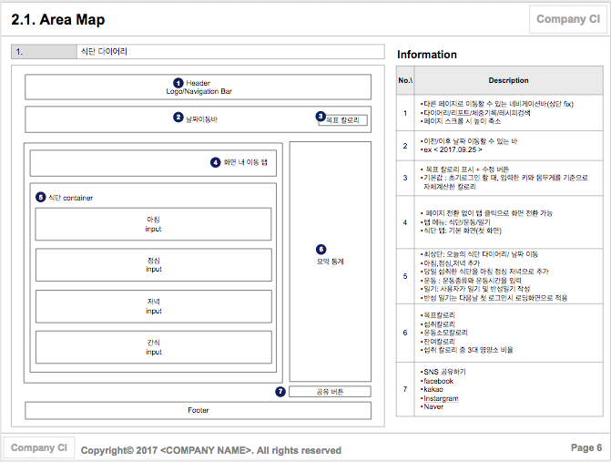
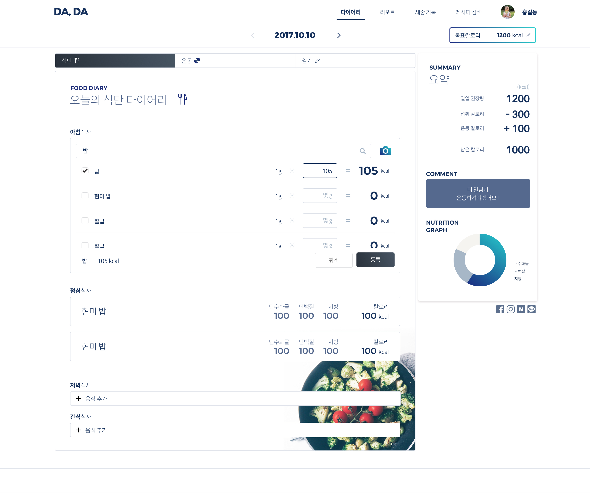
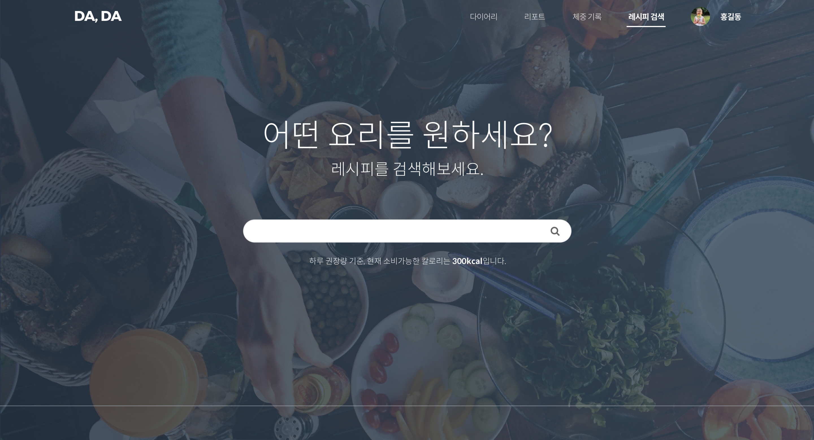

# Da, Da
<기록과 통계>를 통해 식습관을 모니터링 할 수 있고,
칼로리 카운트를 통해 식단을 관리할 수 있는 회원제 <다이어트 다이어리> 서비스

 

## 서비스 목표

바른 다이어트를 위해서는 건강하고 균형잡힌 식습관을 유지할 필요가 있다.
- 사용자가 복잡하고 번거로운 칼로리/영양성분 계산을 하지 않아도 되게 하자.
- 사용자가 식단을 기록하고, 통계를 확인하면서 본인의 식습관을 차차 교정하도록 유도하자.

***사용자가 건강한 식습관을 유지할 수 있도록 식단 관리를 서포트해주는 편리한 서비스를 제공하자.***

 

## 서비스 기능 요약

### 1. 기록(주요 기능)

- **식단 기록**
  - 텍스트 검색과 사진 검색을 지원한다.
  - 검색을 통해 아침/점심/저녁/간식 식사 정보를 기록할 수 있다.

- **사진 기록**
  - 사진을 업로드할 수 있다.
  - 업로드한 사진은 앨범을 통해 보관할 수 있다.
  - 앨범에 저장된 사진은 이후 다른 날 식단 다이어리에서도 첨부하거나 사진 검색에 활용할 수 있다.

- **일기 기록**
  - 당일 장문의 일기와 짧은 반성 일기를 남길 수 있다.
  - 반성 일기는 다음 날 로그인시 홈 로딩화면 위에 표시된다.

- **체중 기록**
  - 시작/목표/현재 체중을 사용자가 직접 입력하거나 삭제 할 수 있다.
  - 시작 체중으로부터 현재 체중까지 변화 양상을 확인할 수 있는 그래프를 제공한다.

 

### 2. 리포트

- 주 별 통계 (차트)
  사용자의 식사 패턴(식사 시간대, 3대 영양소 비율)에 대한 막대그래프와 요약 정보를 제공한다.

 

### 3. 레시피 검색

- **검색**
텍스트 검색과 사진 검색을 지원한다.

- **레시피 정보**
  - 원하는 레시피 정보를 조회할 수 있다.
  - 레시피 화면을 통해 요리 진행 사항을 체크할 수 있다. (체크박스 제공)
  - 레시피 재료의 양 정보를 기준 인분 수  입력을 통해 조정된 값으로 제공받을 수 있다.
  - 레시피로 조리된 음식을 식단에 기록할 수 있다.

 

### 4. 로그인
- 로그인은 소셜로그인만 지원한다.
- 네이버, 카카오, 페이스북, 인스타그램 로그인을 지원한다.

 

### 5. SNS공유
- 식단 및 통계를 미리 디자인된 정적 페이지로 각 소셜에 공유할 수 있다.

 

## 팀 구성원

#### 프론트엔드

 - [김나영](https://github.com/feel5ny)
 - [이혜승](https://github.com/huusz)

#### 백엔드

- [김세준](https://github.com/KimSejune)
- [임옥택](https://github.com/downmix)
- [조수현](https://github.com/suhyeon)

 

## 기술 스택 & 툴

### ProtoType & Design
- Google spread sheet
- Sketch
- [Invision](https://invis.io/DCE154SUH)

 

### Frontend

**1) UI**
- React
- React-Router
- Redux
- CSS

 

**1-1) Extension or Frameworks**
- [Semantic-ui-react](https://react.semantic-ui.com/) (CSS Framework)
- [Draft.js](https://draftjs.org/) (Text editor Framework)
- [recharts.js](http://recharts.org/#/en-US) (Chart Package)

 

**2) Network**
- fetch API

 

**3) Package Manager**
- yarn

 

**4) Convention & Task Manager**
- editor config
- prettier (formatter)
- eslint
- webpack

 

### Backend

**1) Server**
- Node.js
- Express

 

**2) Database**
- MYSQL
- KNEX (node-mysql connector)

 

**3) Open API**

- [Googl Vision API](https://cloud.google.com/vision/)
- AWS (supported: EC2, S3(Image Storage), Caddy): Cloud Web Server
- Redis(supported: KUE): In-memory data structure store

 

**4) Package Manager**
- npm

 

**5) Convention**
- editor config
- eslint

 

**6) Error Reporting Manager**
- BugSnag

 

## Team Work
- Git (소스 코드 버전 관리)
- Zeplin (디자인 시안 공유)
- 오프라인 회의(수/금) & HangOut 온라인 회의 (월/화/목)
- Scrum Board: Google Spread Sheet (매일 진행 사항 공유 & 일정 관리)
- [Github](https://github.com/huusz/Da-Da) & [Github Projects](https://github.com/huusz/Da-Da/projects) (작업 분담(기능별 & 페이지별) 및 이슈 관리)
- [API Document](https://api.downmix.net/)

 

---

## Summary

### 기획 및 프로토타입

#### 1) 와이어프레임

 

#### 2) 디자인 시안

 

#### 3) 프로토타입

> [프로토타입 보기](https://invis.io/DCE154SUH)

